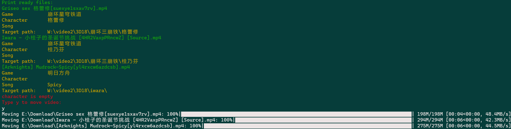

# iwara-files-classifier

Classify `iwara.tv` videos into different target files (e,g. `Genshin/Ayaka`) by tag-info (e.g, character/game name) in video filename on Win10.

## Usage

> [!Caution]  
> Even I am a LSP, but I love China.

## My iwara Usage

1. Click and download manually using `iwara批量下载工具` in Tampermonkey and `IDM` to speedup the download. (Considered download all cost huge disk space and the Quality always up and down)
2. manually classifier `mp4` into different files by the character/game name. e,g. `原神/雷电将军`

## Further idea

1. Design a Quality model to decide which `mp4` should be downloaded. (Consider my XP, view counts and star counts after 3 days)
